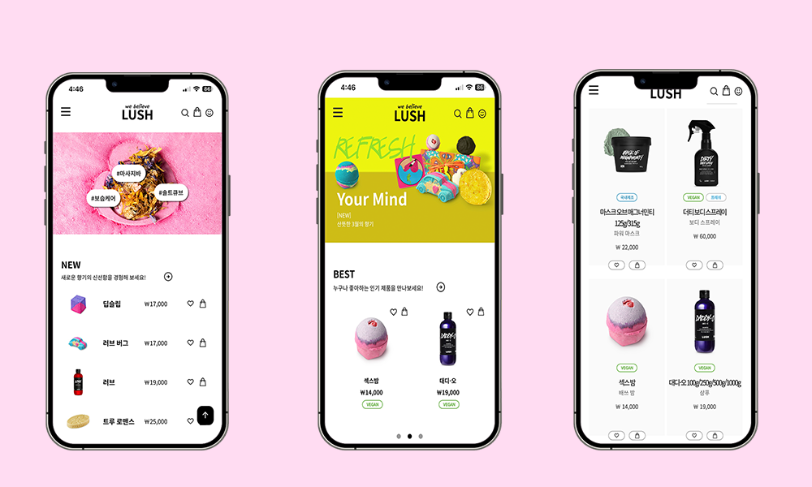

# 안녕하세요 신입 웹 프론트엔드 개발자 성해련 입니다.

<br>

### LUSH 리뉴얼
### "믿을 수 있는 제품 LUSH"

<br>



<br>

- Demo : http://rien.dothome.co.kr/mobile/
  - 모바일 전용 페이지 입니다.

<br>

---

### 개발 목표
  - 친환경 제품으로 고객에게 신뢰도를 주는 이미지의 로고 변경과 메인 화면에서 대표 제품을 바로 확인 할 수 있도록 UI설계

  <br>

### 사용 기술
  - HTML
  - CSS
  - Javascript
  - Jquery
  - PHP

  <br>

### 라이브러리
  - slick
  - cookie

  <br>

## Point

### **BEST 메뉴 자동 변경 구현**

<br>

인디케이터를 클릭 시 해당 메뉴가 보이도록 설정 후<br>
setInterval 함수를 이용해 5초마다 인디케이터가 자동으로 클릭 되로록 작성
```js
const on = $('#roll a')
const bMenu = $('.b_menu')


let btnNum = 0

for (let i = 0; i < on.length; i++) {
  on[i].addEventListener('click', function(e) {
    e.preventDefault()

    on.removeClass('on')
    bMenu.removeClass('active')

    on[i].classList.add('on')
    bMenu[i].classList.add('active')

    return btnNum = i
  })
}

const Move = setInterval(function() {
  btnNum++
  if(btnNum > 2) {btnNum = 0}
  on[btnNum].click()
},5000)


```
<br>
